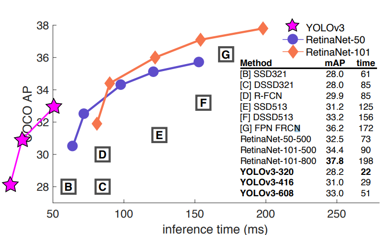
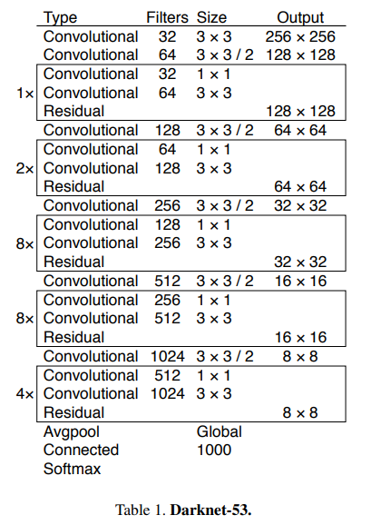
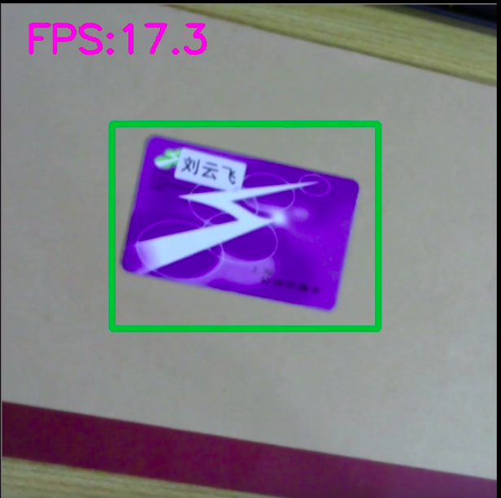

# YOLOv3 训练自己的数据集

will add more soon!

作者：刘云飞

建议与合作联系邮箱：liuyunfei.1314@163.com

### 0x00 语言和工具

语言：Python 3.7

框架：PyTorch 1.2

标注工具：LabelImg

网络结构：Yolo v3

### 0x01 数据集及标注

标注4类：

card 、tools、mouse、starbucks

例：

### 0x02  使用YOLOv3训练

Yolo 算是目前比较工程使用最多的算法之一了，无论是理解还是实现都比较简洁。

本例在右侧代码上修改而成，原始代码from: https://github.com/eriklindernoren/PyTorch-YOLOv3  

论文的链接：https://arxiv.org/abs/1804.02767

Yolo 的推断时间，可以看下图，超越现有算法很多。

Yolo v3 的backbone使用自己的darknet53，实现上也很简洁，参考了Resnet的结构。

### 0x03 效果

用摄像头跑，结果展示，FPS在17-21之间，达到了实时检测的效果。

视频 B站链接：https://www.bilibili.com/video/av76005760

图片如下：

